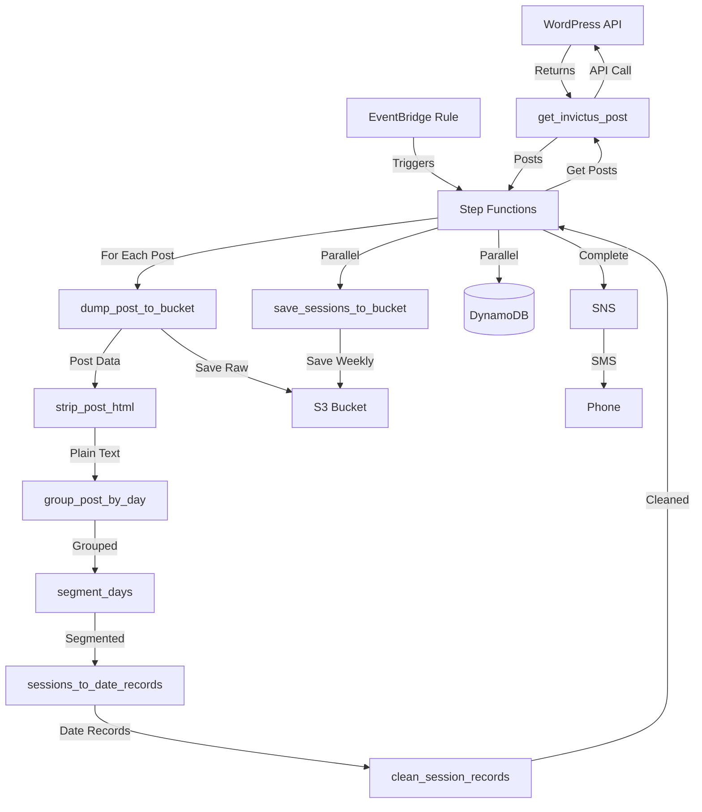

# Invictus Weightlifting WOD ETL

A serverless ETL pipeline that extracts, transforms, and loads weightlifting workout data from the CrossFit Invictus blog. The pipeline processes WordPress blog posts, structures workout sessions by day, and stores the data in AWS S3 and DynamoDB.

## Overview

This project automates the extraction of weightlifting workout programs from the CrossFit Invictus WordPress blog. It uses AWS Step Functions to orchestrate a series of Lambda functions that:

1. Fetch blog posts from the WordPress REST API
2. Extract and clean HTML content
3. Parse and structure workouts by day
4. Segment workouts into individual exercises
5. Store structured data in DynamoDB and S3

The pipeline includes idempotency mechanisms to prevent duplicate processing and ensure data consistency.

## Architecture

The pipeline is built using:

- **AWS Lambda** - Serverless compute for data processing
- **AWS Step Functions** - Orchestrates the ETL workflow
- **AWS S3** - Stores raw posts and processed JSON data
- **AWS DynamoDB** - Stores structured workout sessions
- **AWS Secrets Manager** - Securely stores WordPress API credentials
- **Serverless Framework** - Infrastructure as code

### Architecture Diagram



### Workflow

```text
GetPost → DumpPostToStagingBucket → StripPostHTML → GroupByDay → 
GetDaySegments → SessionsToDateRecordsJSON → CleanSessionRecords → 
PersistRecords (DynamoDB + S3)
```

## Prerequisites

- Python 3.9
- Node.js (for Serverless Framework)
- AWS CLI configured with appropriate credentials
- Serverless Framework CLI
- `uv` package manager (recommended) or `pip`

## Setup

### 1. Clone the repository

```bash
git clone <repository-url>
cd weightlifting-WOD-ETL
```

### 2. Install Python dependencies

Using `uv` (recommended):

```bash
# Create virtual environment
python3.9 -m venv .venv
source .venv/bin/activate

# Install dependencies
uv pip install -r requirements.txt
```

Or using `pip`:

```bash
python3.9 -m venv .venv
source .venv/bin/activate
pip install -r requirements.txt
```

### 3. Install Node.js dependencies

```bash
npm install
```

### 4. Configure environment variables

Create a `.env` file in the project root:

```bash
INVICTUS_USER=your_wordpress_username
INVICTUS_PASS=your_wordpress_password
```

### Quick Start with Make

Alternatively, use Make commands for a streamlined setup:

```bash
# Complete setup (creates venv and installs all dependencies)
make setup

# Or step by step
make venv
make install
```

## Make Commands

The project includes a `Makefile` with convenient commands for common tasks. Run `make help` to see all available commands.

### Setup Commands

```bash
make setup              # Complete project setup (venv + dependencies)
make install            # Install all dependencies (Python + Node)
make install-python     # Install Python dependencies only
make install-node       # Install Node.js dependencies only
make venv               # Create Python virtual environment
```

### Testing Commands

```bash
make test               # Run all tests
make test-infra         # Run infrastructure tests only
make test-cov           # Run tests with coverage report
make test-verbose       # Run tests with verbose output
```

### Deployment Commands

```bash
make plan               # Preview deployment changes (dry-run, like terraform plan)
make plan-prod          # Preview production deployment changes
make deploy             # Deploy to dev stage
make deploy-prod        # Deploy to prod stage
make deploy-function FUNC=get_invictus_post  # Deploy single function
```

### Local Development Commands

```bash
# Invoke function locally
make invoke FUNC=get_invictus_post EVENT=test_events/get_invictus_post.json

# View logs
make logs FUNC=get_invictus_post
make logs-tail FUNC=get_invictus_post
```

### Code Quality Commands

```bash
make lint               # Run linting checks
make format             # Format code with autopep8
```

### Cleanup Commands

```bash
make clean              # Remove build artifacts and caches
make remove             # Remove virtual environment
```

## Configuration

The main configuration is in `serverless.yml` with modular configuration files in `serverless/`. Key settings:

- **Runtime**: Python 3.9
- **Region**: Configurable via `AWS_REGION` environment variable (default: us-east-1)
- **Stage**: dev (configurable via `--stage` flag or `STAGE` environment variable)
- **S3 Bucket**: Configurable via `INVICTUS_BUCKET` environment variable
- **Python Requirements**: Uses `requirements-prod.txt` for Lambda packaging
- **Docker**: Uses Docker for non-Linux pip installations (via `serverless-python-requirements` plugin)

## Usage

### Local Development

**Using Make (recommended):**

```bash
# Run all tests
make test

# Run infrastructure tests only
make test-infra

# Run with coverage
make test-cov
```

**Using direct commands:**

```bash
# Activate virtual environment
source .venv/bin/activate

# Run all tests
pytest

# Run infrastructure tests only
pytest -m infrastructure

# Run with coverage
pytest --cov
```

### Deploy to AWS

**Using Make (recommended):**

```bash
# Preview deployment changes (dry-run, similar to terraform plan)
make plan

# Preview production deployment changes
make plan-prod

# Deploy to dev stage
make deploy

# Deploy to prod stage
make deploy-prod

# Deploy a single function
make deploy-function FUNC=get_invictus_post
```

**Using direct commands:**

```bash
# Preview deployment (package without deploying)
npx serverless package --stage dev

# View compiled configuration
npx serverless print --stage dev

# Deploy the entire stack
npx serverless deploy

# Deploy to a specific stage
npx serverless deploy --stage prod

# Deploy a single function
npx serverless deploy function -f get_invictus_post
```

### Invoke Functions Locally

**Using Make (recommended):**

```bash
make invoke FUNC=get_invictus_post EVENT=test_events/get_invictus_post.json
```

**Using direct commands:**

```bash
npx serverless invoke local -f get_invictus_post --path test_events/get_invictus_post.json
```

### View Logs

**Using Make (recommended):**

```bash
# View logs
make logs FUNC=get_invictus_post

# Tail logs
make logs-tail FUNC=get_invictus_post
```

**Using direct commands:**

```bash
# View logs
npx serverless logs -f get_invictus_post

# Tail logs
npx serverless logs -f get_invictus_post --tail
```

## Testing

The project includes comprehensive tests using `pytest` and `moto` for AWS service mocking.

### Test Structure

- `tests/test_infrastructure.py` - Tests for DynamoDB tables, Secrets Manager configuration, and TTL settings
- `tests/test_idempotency.py` - Unit tests for idempotency key generation, DynamoDB checks, and S3 idempotency
- `tests/test_idempotency_integration.py` - Integration tests for idempotency behavior in Lambda functions

### Running Tests

**Using Make (recommended):**

```bash
# Run all tests
make test

# Run with verbose output
make test-verbose

# Run infrastructure tests only
make test-infra

# Run with coverage report
make test-cov
```

**Using direct commands:**

```bash
# Run all tests
pytest

# Run with verbose output
pytest -v

# Run specific test file
pytest tests/test_infrastructure.py

# Run with coverage report
pytest --cov --cov-report=html
```

## Project Structure

```text
.
├── handler.py              # Main Lambda handler functions (includes idempotency logic)
├── transforms.py           # Data transformation functions
├── serverless.yml          # Serverless Framework main configuration
├── serverless/             # Modular Serverless configuration
│   ├── environment.yml     # Environment variables
│   ├── functions.yml       # Lambda function definitions
│   ├── iam.yml             # IAM role statements
│   └── resources.yml       # AWS resources (DynamoDB, Secrets Manager, etc.)
├── SemiStructureInvictusPost_stateMachine.yml  # Step Functions state machine definition
├── requirements.txt        # Python dependencies
├── requirements-prod.txt   # Production Python dependencies (used for Lambda packaging)
├── package.json           # Node.js dependencies
├── pytest.ini             # Pytest configuration
├── Makefile               # Make commands for common tasks
├── tests/                  # Test files
│   ├── __init__.py
│   ├── test_infrastructure.py      # Infrastructure tests
│   ├── test_idempotency.py         # Idempotency unit tests
│   └── test_idempotency_integration.py  # Idempotency integration tests
└── test_events/           # Sample event data for testing
    ├── get_invictus_post.json
    ├── clean_session_records.json
    ├── group_post_by_day.json
    ├── segment_days.json
    ├── segmented_sessions.json
    ├── save_sessions_to_bucket.json
    ├── test_idempotency.json
    └── weekly/            # Weekly session examples
        └── 2021-01-03__2021-01-08--5-day-weightlifting-program.json
```

## Lambda Functions

- **`get_invictus_post`** - Fetches blog posts from WordPress API
- **`dump_post_to_bucket`** - Saves raw posts to S3 (with idempotency checks)
- **`strip_post_html`** - Removes HTML markup from post content
- **`group_post_by_day`** - Groups content by workout day
- **`segment_days`** - Segments workouts into exercise components
- **`sessions_to_date_records`** - Converts sessions to date-based records
- **`clean_session_records`** - Cleans and normalizes session data
- **`save_sessions_to_bucket`** - Saves processed sessions to S3 (with idempotency checks)

## AWS Resources

### DynamoDB Tables

- **WorkoutPostsTable** - Stores structured workout sessions
  - Partition Key: `date` (String)
  - Sort Key: `session` (String)

- **IdempotencyTable** - Prevents duplicate processing
  - Partition Key: `idempotency_key` (String)
  - TTL enabled on `ttl` attribute (default: 24 hours)
  - Automatically expires records to prevent table growth

### Secrets Manager

- **WordPressCredentialsSecret** - Stores WordPress API credentials

### Step Functions

- **SemiStructureInvictusPostStateMachine** - Orchestrates the ETL workflow

## Environment Variables

| Variable | Description | Default |
|----------|-------------|---------|
| `INVICTUS_BUCKET` | S3 bucket for storing data | `invictus-test-213` |
| `INVICTUS_WEIGHTLIFTING_API` | WordPress API endpoint URL | Required |
| `INVICTUS_WEIGHTLIFTING_API_CAT_ID` | WordPress category ID | `213` |
| `INVICTUS_USER` | WordPress API username | From `.env` or Secrets Manager |
| `INVICTUS_PASS` | WordPress API password | From `.env` or Secrets Manager |
| `DYNAMODB_TABLE` | DynamoDB table name | Auto-generated |
| `IDEMPOTENCY_TABLE` | Idempotency table name | Auto-generated |
| `AWS_REGION` | AWS region for deployment | `us-east-1` |
| `AWS_PROFILE` | AWS CLI profile for deployment | `serverless-invictus-agent` |

## Idempotency

The pipeline implements idempotency to prevent duplicate processing and ensure data consistency:

- **DynamoDB-based idempotency**: Uses an IdempotencyTable to track completed operations
- **S3-based idempotency**: Checks for existing objects before writing
- **Fail-open design**: If idempotency checks fail, operations proceed (prevents blocking on infrastructure issues)
- **TTL-based expiration**: Idempotency records expire after 24 hours to prevent table growth

Idempotency keys are generated using SHA256 hashes of operation names and unique identifiers (e.g., S3 paths, post slugs).

## Development

### Code Style

The project uses:

- `autopep8` for code formatting
- `pycodestyle` for linting

**Using Make:**

```bash
# Format code
make format

# Run linting
make lint
```

**Using direct commands:**

```bash
# Format code
autopep8 --in-place --aggressive --aggressive --max-line-length=120 handler.py transforms.py tests/

# Run linting
pycodestyle --max-line-length=120 handler.py transforms.py tests/
```

### Adding New Functions

1. Add the function handler to `handler.py` or `transforms.py`
2. Define the function in `serverless/functions.yml`
3. Update the Step Functions definition in `SemiStructureInvictusPost_stateMachine.yml` if needed
4. Add tests in `tests/`
5. Consider adding idempotency checks for functions that write data

## Troubleshooting

### Common Issues

**Import errors with moto:**

- Ensure you're using Python 3.9
- Reinstall dependencies: `uv pip install -r requirements.txt` or `make install-python`

**AWS credential errors:**

- Verify AWS CLI is configured: `aws configure`
- Check Serverless profile: `serverless.yml` uses `serverless-invictus-agent` profile by default
- Set `AWS_PROFILE` environment variable if using a different profile

**Deployment failures:**

- Check IAM permissions for the deployment role
- Verify all environment variables are set in `.env` or AWS Secrets Manager
- Check CloudFormation stack events in AWS Console
- Ensure S3 bucket exists and is accessible

**Idempotency issues:**

- Verify `IDEMPOTENCY_TABLE` environment variable is set
- Check DynamoDB table exists and has correct schema
- Review CloudWatch logs for idempotency warnings
